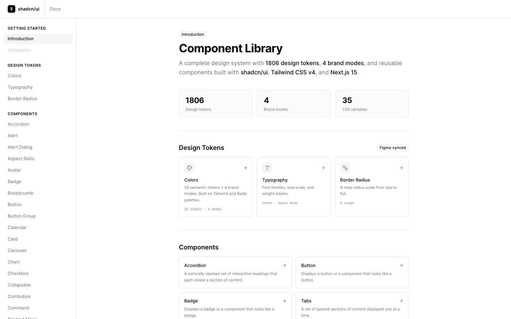
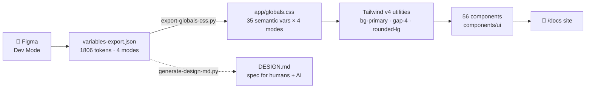
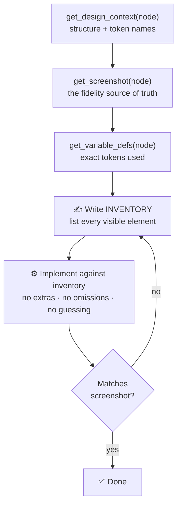
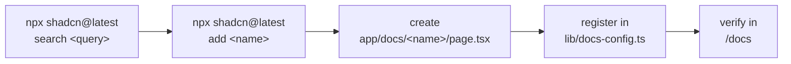

<div align="center">

# 🎨 shadcn-skills-design-starter

### Design-system-first starter for **Figma → Code** at production fidelity

A browsable component docs site · 56 shadcn/ui components wired to Figma-synced tokens · 18 Claude Code design skills · 138 named design systems — all in one repo.

<br/>

[](https://nextjs.org)
[](https://react.dev)
[](https://www.typescriptlang.org)
[](https://tailwindcss.com)
[](https://ui.shadcn.com)
[](#-license)


<br/>



<sub>The component docs site at <code>/docs</code> — live previews, design tokens, and all 56 components.</sub>

</div>

---

## 📑 Table of Contents

- [What is this?](#-what-is-this)
- [Quick start](#-quick-start)
- [The component docs site](#-the-component-docs-site)
- [Architecture & token pipeline](#-architecture--token-pipeline)
- [Project structure](#-project-structure)
- [Workflows](#-workflows)
  - [1. Figma → Code](#1-figma--code-pixel-fidelity)
  - [2. Regenerate tokens after a Figma export](#2-regenerate-tokens-after-a-figma-export)
  - [3. Add a new component end-to-end](#3-add-a-new-component-end-to-end)
  - [4. Switch brand modes at runtime](#4-switch-brand-modes-at-runtime)
  - [5. Work with the Claude design skills](#5-work-with-the-claude-design-skills)
- [Design tokens](#-design-tokens)
- [Claude Code design skills](#-claude-code-design-skills)
- [Components](#-components)
- [Conventions](#-conventions)
- [Scripts reference](#-scripts-reference)
- [Security](#-security)
- [References](#-references)
- [License](#-license)

---

## 🌟 What is this?

This starter is **three products in one repository**:

| | | |
| :-: | --- | --- |
| 📖 | **A live component docs site** | Every shadcn/ui component documented at `/docs` — interactive **Preview ⇄ Code** tabs, props tables, and token explorers. |
| 🎨 | **A Figma-synced design system** | 1806 tokens, a 3-tier model, and **4 brand modes** that re-theme every component automatically. |
| 🤖 | **A Claude Code design studio** | 18 skills (build, audit, tokens, a11y, redesign, UX writing, Figma sync) + a library of **138 named design systems**. |

> [!TIP]
> Run it, open [`/docs`](http://localhost:3000/docs), and browse all 56 components live. Then point Claude Code at a Figma node and build new screens against the same tokens.

---

## 🚀 Quick start

```bash
git clone https://github.com/pangsaxo-ops/shadcn-skills-design-starter.git
cd shadcn-skills-design-starter
npm install
npm run dev
```

Open **[http://localhost:3000](http://localhost:3000)** — the home route redirects to the docs site at `/docs`.

<details>
<summary><b>Optional — Figma REST access</b></summary>

<br/>

For pulling Figma nodes via REST (a fallback when the Figma MCP is rate-limited), create `.env.local`:

```bash
echo 'FIGMA_ACCESS_TOKEN=figd_your_token_here' > .env.local
```

> [!WARNING]
> `.env.local` is gitignored — **never commit a token**. Generate one at Figma → Settings → Security → Personal access tokens.

</details>

---

## 📖 The component docs site

A full documentation site lives under [`app/docs/`](./app/docs), navigable from a three-group sidebar:

| Group | Pages |
| --- | --- |
| **Getting Started** | Introduction |
| **Design Tokens** | Colors (35 semantic × 4 modes) · Typography · Border Radius |
| **Components** | All 56 — each with **Preview / Code** tabs, installation, usage, examples, and a props table |

**Building blocks** (`components/docs/`):

| File | Role |
| --- | --- |
| `sidebar-nav.tsx` | Active-route-aware left navigation |
| `component-preview.tsx` | The **Preview ⇄ Code** tabbed wrapper |
| `code-block.tsx` | Syntax-styled code |
| `color-palette.tsx` | Click-to-copy color swatches |
| `semantic-tokens-panel.tsx` | Mode switcher + all-modes comparison table |
| `mode-switcher.tsx` | light / dark / primary / secondary toggle |

> The nav tree lives in [`lib/docs-config.ts`](./lib/docs-config.ts) — add a component there to make it appear in the sidebar.

---

## 🏗 Architecture & token pipeline

Design intent flows one direction — from Figma all the way to rendered components — so the source of truth is always the design file.



> [!NOTE]
> Components only ever touch **Tier 3** utilities. Change one **Tier 2** variable in `globals.css` and every component re-themes across all four brand modes.

---

## 📁 Project structure

```
shadcn-skills-design-starter/
│
├── app/
│   ├── layout.tsx               # ThemeProvider · next/font · metadata
│   ├── page.tsx                 # redirects → /docs
│   ├── globals.css              # ALL design tokens — generated, do not hand-edit
│   └── docs/                    # 📖 the component documentation site (58 pages)
│
├── components/
│   ├── ui/                      # 56 shadcn components — CLI-managed, never hand-write
│   └── docs/                    # docs-site building blocks
│
├── lib/
│   ├── utils.ts                 # cn() helper (clsx + tailwind-merge)
│   ├── docs-config.ts           # docs navigation tree
│   └── tokens-data.ts           # token extraction for the token pages
│
├── hooks/                       # use-mobile + custom hooks ("use client")
│
├── assets/
│   └── variables-export.json    # 1806 design tokens · 17 collections · 4 modes
│
├── scripts/
│   ├── export-globals-css.py    # rebuild app/globals.css from token JSON
│   ├── generate-design-md.py    # rebuild DESIGN.md from token JSON
│   ├── validate-tokens.py       # verify all 1806 tokens are documented
│   └── fetch-figma-node.js      # Figma REST helper (token from .env.local)
│
├── .claude/skills/              # 🤖 18 Claude Code skills
│
├── ux-ui-agent-skills/          # bundled design kit (138 systems · tokens · scripts)
│
├── CLAUDE.md                    # Claude Code instructions — loaded every session
├── AGENTS.md                    # instructions for all AI agents
└── DESIGN.md                    # complete design system spec (1806 tokens)
```

---

## 🔄 Workflows

### 1. Figma → Code (pixel fidelity)

The core loop, enforced by the [`shadcn-ui`](./.claude/skills/shadcn-ui) skill, which auto-triggers when Claude Code touches a Figma node or shadcn component.



**The fidelity contract**

| Rule | Meaning |
| --- | --- |
| 🚫 **No adding** | If Figma doesn't show it — don't code it |
| 🚫 **No removing** | If Figma shows 13 px — code 13 px, not 14 |
| 🚫 **No inferring** | Uncertain value → stop and ask |
| 🚫 **No polishing** | Honour the design, don't improve it |

<details>
<summary><b>REST fallback — when the Figma MCP is rate-limited</b></summary>

<br/>

```bash
# find a node by name (e.g. the Fieldset component)
node scripts/fetch-figma-node.js --search fieldset <fileKey> <rootNodeId>

# fetch a node's JSON + a PNG render
node scripts/fetch-figma-node.js <nodeId> [fileKey]
```

Reads `FIGMA_ACCESS_TOKEN` from `.env.local`; output is written to `.figma-cache/` (gitignored). This is how the `field` component was audited 1:1 against its Figma source.

</details>

---

### 2. Regenerate tokens after a Figma export

When the design team re-exports `assets/variables-export.json`, rebuild everything downstream:

```bash
python3 scripts/export-globals-css.py    # 1️⃣ rebuild app/globals.css (all 4 modes)
python3 scripts/generate-design-md.py    # 2️⃣ rebuild DESIGN.md (the spec)
python3 scripts/validate-tokens.py       # 3️⃣ verify all 1806 tokens are present
```

> [!IMPORTANT]
> `app/globals.css` is **generated** — never edit token values by hand. Edit the Figma source, re-export, regenerate.

---

### 3. Add a new component end-to-end



```bash
npx shadcn@latest search combobox        # 1️⃣ find it in the registry
npx shadcn@latest add combobox           # 2️⃣ install (never hand-write components/ui)
#                                          3️⃣ add app/docs/combobox/page.tsx (Preview/Code/Props)
#                                          4️⃣ add { title, href } to lib/docs-config.ts
npm run dev                              # 5️⃣ confirm it renders at /docs/combobox
```

> [!WARNING]
> Don't run `npm run build` while `npm run dev` is running — they share `.next` and the dev cache can corrupt (symptoms: CSS 404s, *"Cannot find module"*, unstyled UI). Fix: stop dev → `rm -rf .next` → `npm run dev`.

---

### 4. Switch brand modes at runtime

Four modes ship out of the box. Toggle them with a single attribute — every token follows.

```tsx
document.documentElement.setAttribute("data-theme", "primary")    // 🔵 blue brand
document.documentElement.setAttribute("data-theme", "secondary")  // 🟡 yellow brand
document.documentElement.removeAttribute("data-theme")            // ⚪ neutral
// light ⇄ dark is handled by next-themes (class strategy)
```

| Mode | Selector | Palette |
| --- | --- | --- |
| `light` | `:root` | Neutral default |
| `dark` | `.dark` | Neutral dark |
| `primary` | `[data-theme="primary"]` | Blue |
| `secondary` | `[data-theme="secondary"]` | Yellow |

---

### 5. Work with the Claude design skills

18 skills load automatically in Claude Code. Describe what you want — the right skill routes itself.

```text
"Audit the field component against Figma"          → shadcn-ui + figma-integration
"Make this dashboard feel like Linear"             → apply-aesthetic (138 systems)
"Check this form against WCAG 2.2"                 → a11y-audit
"Generate a Svelte data table from these tokens"   → design-code
"Write the empty-state copy for onboarding"        → ux-writing
"Turn this screenshot into a component"            → image-to-code
```

> For this project's own app code, **`shadcn-ui`** is always the primary skill — the rest extend into cross-framework, audit, and design-system work.

---

## 🎨 Design tokens

All tokens live in [`assets/variables-export.json`](./assets/variables-export.json), exported from Figma in the **lazyyysync-variables-v1** format.

### Three-tier model

```
Tier 1 — Primitives   tw/colors (244) · rdx/colors (396) · tokens (87)
                       Raw values — never used directly in components

Tier 2 — Semantic     shadcn/ui (35 vars) in app/globals.css
                       --background · --primary · --muted-foreground …

Tier 3 — Utilities    bg-primary · text-muted-foreground · gap-4 · rounded-lg …
                       What components actually use ✅
```

<details>
<summary><b>17 collections · 1806 variables</b></summary>

<br/>

| Collection | Variables | Type |
| --- | --- | --- |
| shadcn/ui | 35 × 4 modes | Semantic color tokens |
| tw/colors | 244 | Tailwind raw palette |
| rdx/colors | 396 | Radix raw palette (light + dark) |
| tokens | 87 | Base numeric primitives |
| border-radius | 150 | All directional variants |
| border-width | 45 | All directional variants |
| font | 45 | Family · size · weight · leading |
| gap / margin / padding | 102 + 245 + 245 | Spacing |
| height / max-height / max-width | 24 + 35 + 51 | Sizing |
| space / stroke-width / opacity | 68 + 11 + 21 | Utilities |
| fontUse | 2 | Typography style |

</details>

---

## 🤖 Claude Code design skills

18 skills live in [`.claude/skills/`](./.claude/skills) and load automatically. One is project-native (`shadcn-ui`); the other 17 come from the bundled [`ux-ui-agent-skills`](./ux-ui-agent-skills) kit and reference its tokens / scripts / 138 design systems.

| Skill | Use it to… |
| --- | --- |
| **shadcn-ui** ⭐ | Build/review shadcn + Tailwind v4 + Next.js UI to this project's rules *(project-native)* |
| **design-tokens** · **token-build** · **brandkit** | Generate/validate DTCG tokens · build platform artifacts · create a brand system |
| **design-component** · **design-code** · **image-to-code** | Spec a component · generate any-framework code · screenshot → code |
| **apply-aesthetic** · **redesign** | Apply 1 of 138 design systems (Apple, Linear, Stripe…) · upgrade an existing UI |
| **design-review** · **design-qa** · **a11y-audit** · **performance** | Critique · CI gates · WCAG 2.2 audit · Core Web Vitals |
| **figma-integration** · **migrate-design-system** | Sync tokens ↔ Figma Variables · bridge Material/HIG/Fluent/Carbon… |
| **governance** · **prototype** · **ux-writing** | Versioning & contribution · fidelity ladder · UI copy |

<details>
<summary><b>About the 138 design systems</b></summary>

<br/>

The `apply-aesthetic` skill can resolve a named look into the token system — e.g. `apple`, `linear-app`, `stripe`, `vercel`, `notion`, `spotify`, `tesla`, `material`, `shadcn`, plus aesthetic archetypes (brutalism, glassmorphism, neumorphism, editorial…). They live in [`ux-ui-agent-skills/design-systems/library/`](./ux-ui-agent-skills/design-systems/library).

</details>

---

## 🧩 Components

All 56 shadcn/ui components are installed and documented.

<details>
<summary><b>Full component list (56)</b></summary>

<br/>

`accordion` · `alert` · `alert-dialog` · `aspect-ratio` · `avatar` · `badge` · `breadcrumb` · `button` · `button-group` · `calendar` · `card` · `carousel` · `chart` · `checkbox` · `collapsible` · `combobox` · `command` · `context-menu` · `dialog` · `direction` · `drawer` · `dropdown-menu` · `empty` · `field` · `form` · `hover-card` · `input` · `input-group` · `input-otp` · `item` · `kbd` · `label` · `menubar` · `native-select` · `navigation-menu` · `pagination` · `popover` · `progress` · `radio-group` · `resizable` · `scroll-area` · `select` · `separator` · `sheet` · `sidebar` · `skeleton` · `slider` · `sonner` · `spinner` · `switch` · `table` · `tabs` · `textarea` · `toggle` · `toggle-group` · `tooltip`

</details>

---

## 📐 Conventions

### Next.js App Router

```tsx
// Default → Server Component (no directive)
export default async function Page() { … }

"use client"   // FIRST line — only for hooks / events / browser APIs
"use server"   // FIRST line — Server Actions
```

Push `"use client"` as deep as possible; keep pages and layouts as Server Components.

### Styling

| ✅ Do | 🚫 Don't |
| --- | --- |
| `bg-primary` · `text-muted-foreground` | `bg-blue-500` · `text-gray-900` |
| `flex flex-col gap-4` | `flex flex-col space-y-4` |
| `size-10` | `w-10 h-10` |
| `cn("base", active && "bg-primary")` | string-concat classNames |
| `<Image src="…" />` | `` |
| `app/globals.css` only | new `.css` files anywhere |
| `npx shadcn@latest add <name>` | hand-writing `components/ui/*` |

---

## 🛠 Scripts reference

| Command | What it does |
| --- | --- |
| `npm run dev` | Dev server at http://localhost:3000 |
| `npm run build` | Production build |
| `npm run lint` | ESLint |
| `npx shadcn@latest info --json` | Show project config |
| `npx shadcn@latest add <name>` | Install a component |
| `python3 scripts/validate-tokens.py` | Verify 1806-token coverage |
| `python3 scripts/export-globals-css.py` | Regenerate CSS from token JSON |
| `python3 scripts/generate-design-md.py` | Regenerate DESIGN.md |
| `node scripts/fetch-figma-node.js …` | Fetch a Figma node via REST |

---

## 🔐 Security

> [!IMPORTANT]
> - **Never commit secrets.** `.env.local`, `.figma-cache/`, `node_modules/`, and `.next/` are gitignored.
> - The only place a Figma token belongs is `.env.local` (local-only).
> - If a token is ever exposed (committed, pasted, shared), **revoke it** at Figma → Settings → Security → Personal access tokens and issue a new one.

This repo's git history has been verified clean of tokens and key material.

---

## 🔗 References

| Resource | Link |
| --- | --- |
| shadcn/ui | [ui.shadcn.com/docs](https://ui.shadcn.com/docs) |
| Next.js App Router | [nextjs.org/docs/app](https://nextjs.org/docs/app) |
| Tailwind CSS v4 | [tailwindcss.com](https://tailwindcss.com) |
| Figma Dev Mode MCP | [figma.com/blog](https://www.figma.com/blog/introducing-figmas-dev-mode-mcp-server/) |
| ux-ui-agent-skills | [github.com/plugin87/ux-ui-agent-skills](https://github.com/plugin87/ux-ui-agent-skills) |
| Claude Code | [claude.ai/code](https://claude.ai/code) |

---

## 📄 License

[MIT](#-license). The bundled [`ux-ui-agent-skills`](./ux-ui-agent-skills) kit is MIT-licensed by [plugin87](https://github.com/plugin87/ux-ui-agent-skills).

<div align="center">

<br/>

**Built with [Claude Code](https://claude.com/claude-code)** · Figma → Code, done right.

</div>
